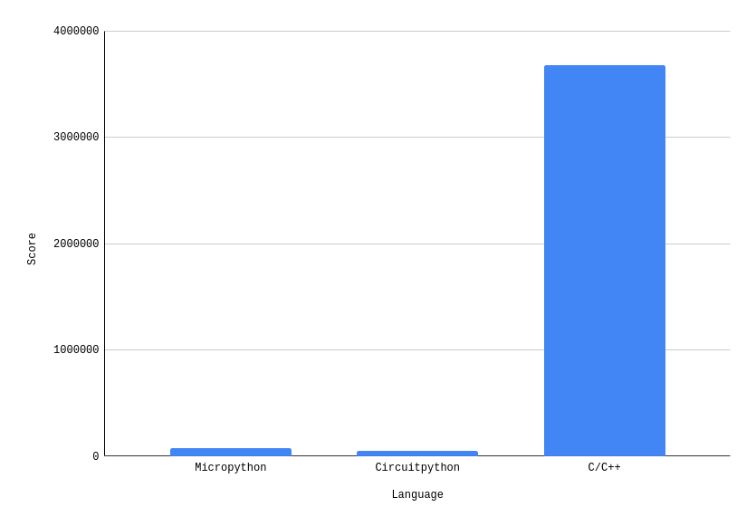

# Raspberry Pi Pico Benchmark

A simple benchmark comparing the speed of raw C/C++, MicroPython and CircuitPython

It creates a variable and continuously increments it in a while loop for exactly 1 second, and
then the result is printed

| Language      | Score   |
|---------------|---------|
| MicroPython   | 79968   |
| CircuitPython | 53654   |
| C/C++         | 3676472 |

And here is that data in a nice graph:

